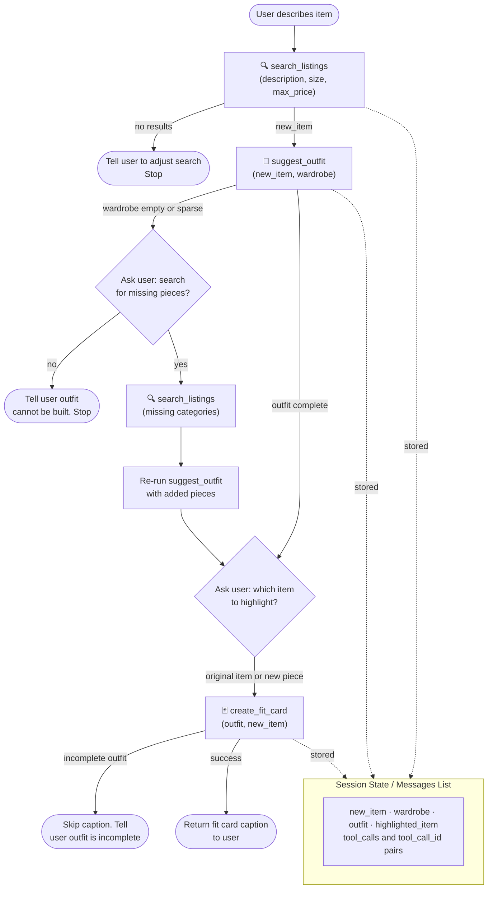

# FitFindr — planning.md

> Complete this document before writing any implementation code.
> Your spec and agent diagram are what you'll use to direct AI tools (Claude, Copilot, etc.) to generate your implementation — the more specific they are, the more useful the generated code will be.
> Your planning.md will be reviewed as part of your submission.
> Update it before starting any stretch features.

---

## Tools

List every tool your agent will use. For each tool, fill in all four fields.
You must have at least 3 tools. The three required tools are listed — add any additional tools below them.

### Tool 1: search_listings

**What it does:**
<!-- Describe what this tool does in 1–2 sentences -->
This tool will look in the listings.json and returns the top 3 matching listings sorted by relevance according to the user's description. It will use the `load_listings()` from `data_loader.py` which returns a list of dictionaries where each dictionary is a certain item.
**Input parameters:**
<!-- List each parameter, its type, and what it represents -->
- `description` (str): This is the description of the clothing wear whether it's a tops, bottoms, outerwear, shoes, accessories. It can also include the color and/or the style of the clothing.
- `size` (str): This is the size of the item where top and for some bottom clothing will be (XS/S/M/L/XL) and they are extra small, small, medium, large, and extra large accordingly. Some of the bottom clothings will provide a waist size like W29 which represents waist size of 29 inches. The example of shoe size will be US 9.5 which is US foot size of 9 inches and a half.
- `max_price` (float): This is the upper limit of price the user is willing to pay for an item.

**Relevance ranking priority:**
0. Description match (hard filter — check if the description keyword appears in the item's title, description, category, or style_tags. If no items match, return empty results immediately. Do not fall back to loose category matches.)
1. Exact `size` match (hard filter — exclude non-matches)
2. Exact `category` match
3. Color similarity to `description`
4. Style tag overlap with `description`

**What it returns:**
<!-- Describe the return value — what fields does a result contain? -->
This tool should return a list of up to 3 dictionaries that contains the closest 
matching items to the user's description. Each of the dictionaries will be directly 
taken from `listings.json` where a dictionary will be in the form of:
{
    "id": string,
    "title": string,
    "description": string,
    "category": string,
    "style_tags": [string],
    "size": string,
    "condition": string,
    "price": float,
    "colors": [string],
    "brand": string,
    "platform": string
}
**What happens if it fails or returns nothing:**
<!-- What should the agent do if no listings match? -->
If no items pass the description match filter, return:
{ "results": [], "message": "No listings matched '[description]'. Try a broader description, different size, or higher price range." }
Do not return loosely related items without telling the user — do not call `suggest_outfit` with empty input.

If results are found, return the top 3 wrapped as: { "results": [...] }
---

### Tool 2: suggest_outfit

**What it does:**
<!-- Describe what this tool does in 1–2 sentences -->
Given a `new_item` and the user's `wardrobe`, suggests one or more complete outfit combinations that pair well with the new item. Each outfit should contain at least one top, one bottom, and shoes — outerwear and accessories are optional additions.
**Input parameters:**
<!-- List each parameter, its type, and what it represents -->
- `new_item` (dict): The item to build an outfit around. Use its `style_tags`, 
  `colors`, `category`, `title`, and `description` fields to determine what 
  complements it.
- `wardrobe` (dict): Contains an `items` list of clothing the user already owns. 
  Each item follows the same schema as `new_item`.

**Relevance ranking priority:**
1. Color compatibility with `new_item`
2. Style tag overlap with `new_item`
3. Fill required categories first (top, bottom, shoes), then optional (outerwear, accessories)

**Handling duplicate new_item:**
If `new_item` already exists in `wardrobe` (matched by `id`), ask the user:
"It looks like you already own this item! Would you like me to:
1. Style it using pieces you already own
2. Find new pieces from listings that pair well with it"
- If (1): proceed with wardrobe only
- If (2): call `search_listings` to find complementary pieces, then suggest an outfit

**What it returns:**
<!-- Describe the return value -->
A list of outfit objects, where each outfit looks like:
{
    "outfit_id": int,
    "pieces": [dict],       // wardrobe items selected for this outfit
    "notes": string         // brief explanation of why these pieces work together
}
**What happens if it fails or returns nothing:**
<!-- What should the agent do if the wardrobe is empty or no outfit can be suggested? -->
- If `wardrobe.items` is empty: return 
  { "results": [], "message": "Your wardrobe is empty. Would you like me to 
  search listings to build a full outfit?" }
- If wardrobe exists but can't complete a full outfit (e.g. no shoes): return 
  whatever partial outfit is possible and note the missing category:
  { "results": [...], "message": "No shoes found in wardrobe to complete this outfit." }

**Dependencies:**
- May call `search_listings` internally if user chooses to find new pairing options

---

### Tool 3: create_fit_card

**What it does:**
<!-- Describe what this tool does in 1–2 sentences -->
Generates a short, shareable caption for a completed outfit — styled like an 
Instagram post. Produces varied output for different inputs where it could relate to the colors, size, or the style of clothings.
**Input parameters:**
<!-- List each parameter, its type, and what it represents -->
- `outfit` (dict): A single outfit object from `suggest_outfit`'s results, 
  containing the `pieces` and `notes` fields.
- `new_item` (dict): The original item the outfit was built around, 
  passed forward from `search_listings`.

**What it returns:**
<!-- Describe the return value -->
A single string — a short, casual caption styled like an Instagram post. 
It should reference the `new_item` (price, platform, or style details) and 
hint at the full outfit. Must vary in tone and wording for different inputs.

Example: "thrifted this faded band tee off depop for $22 and honestly it was 
made for my wide-legs 🖤 full look in my stories"

**What happens if it fails or returns nothing:**
<!-- What should the agent do if the outfit data is incomplete? -->
- If `outfit` is missing required pieces (no top, bottom, or shoes): tell the 
  user the outfit is incomplete and skip generating a caption.
- If `new_item` is missing key fields (no price, platform, or description): 
  generate the caption using whatever fields are available, omitting missing details.
**Dependencies:**
- Requires a completed outfit from `suggest_outfit`
- Do not call if `suggest_outfit` returned empty results

---

### Additional Tools (if any)

<!-- Copy the block above for any tools beyond the required three -->

---

## Planning Loop

**How does your agent decide which tool to call next?**
<!-- Describe the logic your planning loop uses. What does it look at? What conditions change its behavior? How does it know when it's done? -->
1. User describes an item they're interested in
   → call `search_listings(description, size, max_price)`
   - If no results: tell the user to try adjusting their description, size, 
     or price range. Stop here.

2. If listings found → call `suggest_outfit(new_item, wardrobe)`
   - If wardrobe is empty or missing key categories (no top, bottom, or shoes):
     ask the user — "Your wardrobe is missing some pieces to complete this outfit. 
     Would you like me to search listings for what's missing?"
     - If yes: call `search_listings` for the missing categories, then re-run
       `suggest_outfit` with the added pieces. Move to step 4.
     - If no: stop and let the user know a full outfit couldn't be built.

3. If outfit is complete from wardrobe alone → ask the user:
   "Which item would you like to highlight for the fit card?"
   Wait for user selection before moving to step 4.

4. call `create_fit_card(outfit, new_item)` where `new_item` is the 
   highlighted piece the user selected:
   - If the outfit was built from wardrobe alone: `new_item` is the 
     original item from `search_listings`
   - If new pieces were added to complete the outfit: ask the user —
     "Which item would you like to highlight for the fit card?
     - The original item you searched for
     - One of the new pieces we found to complete the outfit"
     Wait for user selection, then pass the chosen item as `new_item`
   Return the fit card caption to the user.
---

## State Management

**How does information from one tool get passed to the next?**
<!-- Describe how your agent stores and accesses state within a session. What data is tracked? How is it passed between tool calls? -->
State lives entirely in the messages list; there is no separate state object. The agent maintains this list throughout the session — user messages, assistant responses, and tool calls/results — and each turn the model re-reads what it needs from the history rather than retrieving it from a persistent store. To pass a value into the next tool, the model extracts it from a prior tool result and writes it into that tool's arguments. The list below documents which values flow between which tools; these are data dependencies, not variables held in memory between calls.
Data flow between tools:

- `new_item` — produced by `search_listings`; the model carries it forward into `suggest_outfit` and `create_fit_card`.
- `wardrobe` — supplied by the user at the start of the session; carried into `suggest_outfit`.
- `outfit` — produced by `suggest_outfit`; carried into `create_fit_card`.
- User selection → `new_item` — when the user picks an item to feature ("the hoodie"), the model resolves that reference to the matching search result and passes it as `new_item` to `create_fit_card`.

Example messages list shape:
[
  { "role": "system", "content": "You are FitFindr, a fashion assistant..." },
  { "role": "user", "content": "find me a black oversized hoodie size M under $40" },
  { "role": "assistant", "tool_calls": [{"id": "call_001", "function": {"name": "search_listings", "arguments": "{\"description\": \"black oversized hoodie\", \"size\": \"M\", \"max_price\": 40.0}"}}]},
  { "role": "tool", "tool_call_id": "call_001", "content": "{\"results\": [{\"id\": \"item_88\", \"title\": \"Black oversized hoodie\", \"price\": 35.0, ...}]}" },
  { "role": "assistant", "tool_calls": [{"id": "call_002", "function": {"name": "suggest_outfit", "arguments": "{\"new_item\": {...}, \"wardrobe\": {...}}"}}]},
  { "role": "tool", "tool_call_id": "call_002", "content": "{\"results\": [{...}]}" },
  { "role": "assistant", "content": "Which item would you like to highlight for the fit card?" },
  { "role": "user", "content": "the hoodie" },
  { "role": "assistant", "tool_calls": [{"id": "call_003", "function": {"name": "create_fit_card", "arguments": "{\"outfit\": {...}, \"new_item\": {\"id\": \"item_88\", ...}}"}}]},
  { "role": "tool", "tool_call_id": "call_003", "content": "\"thrifted this black hoodie off depop for $35 and it goes with everything 🖤\"" }
]
---

## Error Handling

For each tool, describe the specific failure mode you're handling and what the agent does in response.

| Tool | Failure mode | Agent response |
|------|-------------|----------------|
| search_listings | No results match the query | "I couldn't find any listings matching that description under $30 in size M. Try broadening your search — for example, a higher price range, a different size, or a simpler description like 'graphic tee' instead of 'vintage graphic tee'." Stop — do not call suggest_outfit. |
| search_listings | Returns empty when searching for missing wardrobe pieces | "I couldn't find any [category] listings to complete the outfit. You can try adjusting the size or price range, or skip that category and style the outfit without it." |
| suggest_outfit | Wardrobe is empty | Ask the user if they'd like to search listings for missing pieces. If no, stop and let the user know a full outfit couldn't be built. |
| suggest_outfit | Wardrobe exists but missing key categories | Ask the user if they'd like to search listings for the missing categories (top, bottom, or shoes). |
| create_fit_card | Outfit input is missing or incomplete | "I don't have enough pieces to write a full fit card yet — the outfit is missing [category]. Head back and complete the outfit first, or I can write a partial caption around just the [new_item]." |
| create_fit_card | `new_item` is missing key fields | Generate the caption using whatever fields are available. If price is missing, omit the price reference. If platform is missing, omit where it was found. If description is missing, lean on style_tags and colors instead. |

---

## Architecture

<!-- Draw a diagram of your agent showing how the components connect:
     User input → Planning Loop → Tools (search_listings, suggest_outfit, create_fit_card)
                                                                          ↕
                                                                   State / Session
     Show what triggers each tool, how state flows between them, and where error paths branch off.
     ASCII art, a Mermaid diagram (https://mermaid.js.org/syntax/flowchart.html), or an embedded
     sketch are all fine. You'll share this diagram with an AI tool when asking it to implement
     the planning loop and each individual tool. -->

---

## AI Tool Plan

<!-- For each part of the implementation below, describe:
     - Which AI tool you plan to use (Claude, Copilot, ChatGPT, etc.)
     - What you'll give it as input (which sections of this planning.md, your agent diagram)
     - What you expect it to produce
     - How you'll verify the output matches your spec before moving on

     "I'll use AI to help me code" is not a plan.
     "I'll give Claude my Tool 1 spec (inputs, return value, failure mode) and ask it to implement
     search_listings() using load_listings() from the data loader — then test it against 3 queries
     before trusting it" is a plan. -->

**Milestone 3 — Individual tool implementations:**
I will use Claude Code on Sonnet 4.6. For each tool I will paste only its spec section (input parameters, relevance ranking, return schema, failure modes) plus any files it depends on (e.g. data_loader.py for search_listings). I'll ask it to implement the function and generate 3 test cases covering a normal match, a partial match, and a no-results case. I'll verify the output matches the return schema and failure behavior defined in the spec before moving to the next tool.
**Milestone 4 — Planning loop and state management:**
I will use Claude Code on Sonnet 4.6. I'll paste the full planning.md (planning loop, state management, and failure table sections) along with all 3 finished tool implementations. I'll ask it to implement the planning loop and test at least 3 cases: a full happy path, an empty wardrobe that triggers search_listings, and a no-results case that stops before suggest_outfit. I'll verify the messages list correctly stores tool_calls and tool_call_id pairs between steps.
---

## A Complete Interaction (Step by Step)

Write out what a full user interaction looks like from start to finish — tool call by tool call. Use a specific example query.

**Example user query:** "I'm looking for a vintage graphic tee under $30. I mostly wear baggy jeans and chunky sneakers. What's out there and how would I style it?"

**Step 1:**
<!-- What does the agent do first? Which tool is called? With what input? -->
The agent calls search_listings with the user's query broken into parameters:
- description: "vintage graphic tee, baggy jeans, chunky sneakers"
- size: not specified — agent asks the user for their size before calling
- max_price: 30.00

search_listings returns up to 3 matching listings from listings.json, ranked by category match first, then color/style tag overlap.

**Step 2:**
<!-- What happens next? What was returned from step 1? What tool is called now? -->
The agent picks the closest match from the results as new_item (e.g. a faded band tee, size M, $22 on Depop) and calls suggest_outfit with:
- new_item: the selected listing dict
- wardrobe: the user's current wardrobe

If wardrobe is missing key categories (no bottoms or shoes), the agent asks:
"Your wardrobe is missing some pieces to complete this outfit. Would you like me to search listings for what's missing?"
- If yes: calls search_listings for the missing categories, re-runs suggest_outfit with the added pieces
- If no: tells the user a full outfit couldn't be built and stops

suggest_outfit returns a list of outfit objects, each with pieces and notes.

**Step 3:**
<!-- Continue until the full interaction is complete -->
The agent presents the outfit suggestion and asks:
"Which item would you like to highlight for the fit card?
- The vintage graphic tee from the listing
- One of the pieces we found to complete the outfit"

Once the user selects, the agent calls create_fit_card with:
- outfit: the outfit object from suggest_outfit
- new_item: the user-selected item

create_fit_card returns a short Instagram-style caption.

**Final output to user:**
<!-- What does the user actually see at the end? -->
The agent presents the top listing results, the suggested outfit 
(pieces listed with a short note on why they work together), and 
the fit card caption. For example:

"found this faded band tee on depop for $22 and it was made for your wide-legs 🖤 chunky sneakers tie the whole thing together"